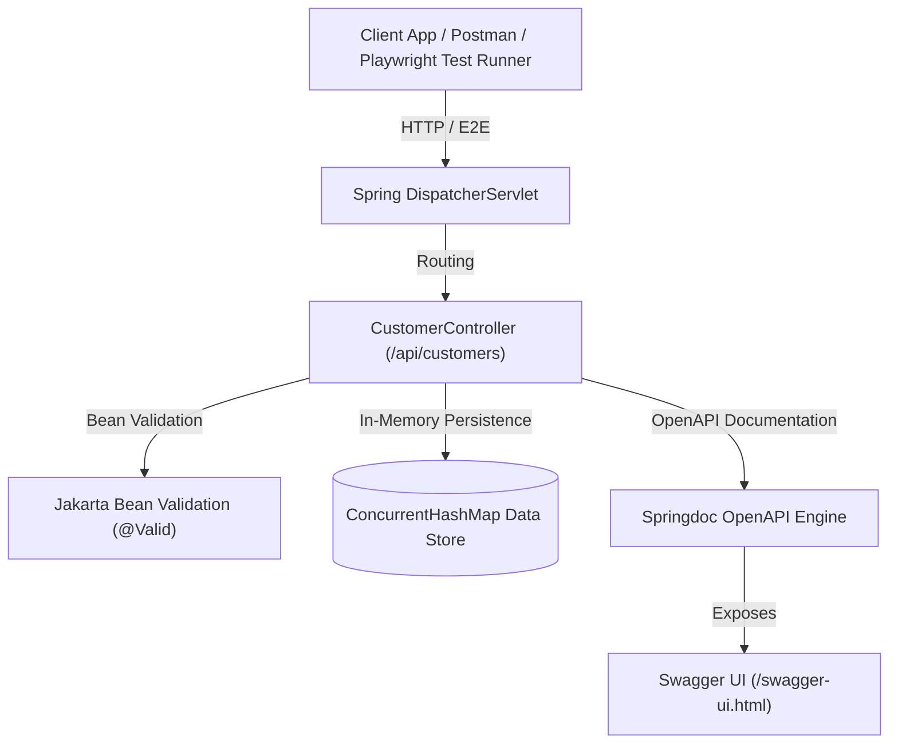
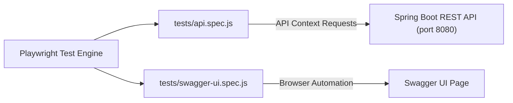
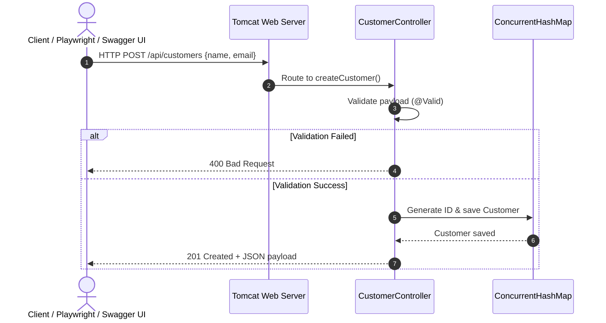

# Customer API System Architecture

This document details the architectural design, component responsibilities, data flow, API specification, and automated testing architecture for the **Customer API** Spring Boot application.

---

## 🏗️ High-Level Architectural Diagram

---

## 🎭 Test Suite Architecture (Playwright)

### Test Suite Components:
1. **`playwright.config.js`**: Configures test runner timeout, target base URL (`http://localhost:8080`), and parallel worker settings.
2. **`tests/api.spec.js`**: API level test suite executing full CRUD workflows directly against Spring Boot HTTP endpoints.
3. **`tests/swagger-ui.spec.js`**: Browser level test suite validating Swagger UI DOM components, header badges, and interactive HTTP operation blocks.

---

## 🧩 Layer & Component Breakdown

### 1. Presentation Layer (`CustomerController` & `MpinController`)
- **Location**: `com.example.demo.controller.CustomerController`, `com.example.demo.controller.MpinController`
- **Role**: Handles REST HTTP requests (`GET`, `POST`, `PUT`, `DELETE`), processes path parameters and request bodies, maps HTTP status codes (200, 201, 204, 400, 401, 423 Locked), and manages MPIN security attempt limits.
- **Annotations**: `@RestController`, `@RequestMapping`, `@Tag`, `@Operation`, `@ApiResponse`.

### 2. Domain Models (`Customer` & MPIN DTOs)
- **Location**: `com.example.demo.model.*`
- **Role**: Data Transfer Objects (DTOs) including `Customer`, `MpinSetupRequest`, `MpinVerifyRequest`, `MpinChangeRequest`, `MpinResetRequest`, `MpinResponse`, and `MpinStatusResponse`. Includes OpenAPI annotations (`@Schema`) and validation rules (`@NotBlank`, `@Email`, `@Pattern`).

### 3. Configuration Layer (`OpenApiConfig`)
- **Location**: `com.example.demo.config.OpenApiConfig`
- **Role**: Customizes the OpenAPI 3 specification metadata (Title, Version, Description, and Contact info).

### 4. Persistence Layer (In-Memory Data Store)
- **Role**: Thread-safe memory storage using `ConcurrentHashMap<Long, Customer>` for customers and `ConcurrentHashMap<String, MpinRecord>` for user MPIN records. Enables high-speed testing without external database dependencies.

---

## 🔄 Request Data Flow & Sequence Diagrams

Detailed sequence diagrams covering all CRUD endpoints, Swagger UI initialization, and Playwright E2E testing workflows are available in [`SEQUENCE_DIAGRAMS.md`](file:///c:/Users/PIYUSH%20BHADANE/Desktop/TEST/Create%20and%20Test%20API%20with%20Swagger/api_server/SEQUENCE_DIAGRAMS.md).

