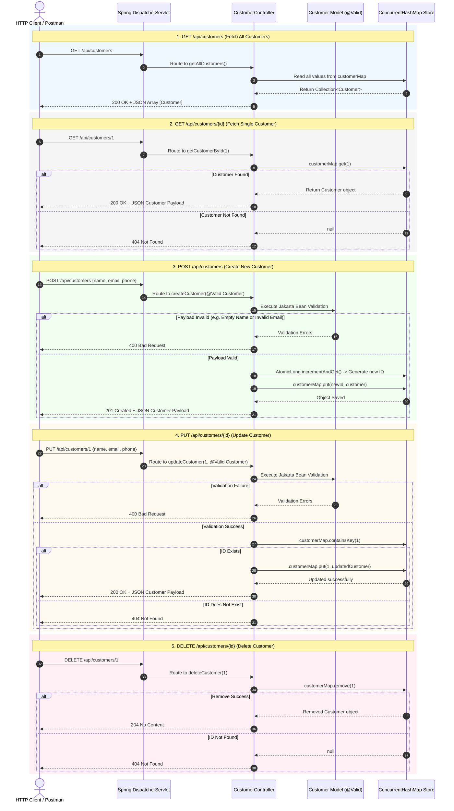
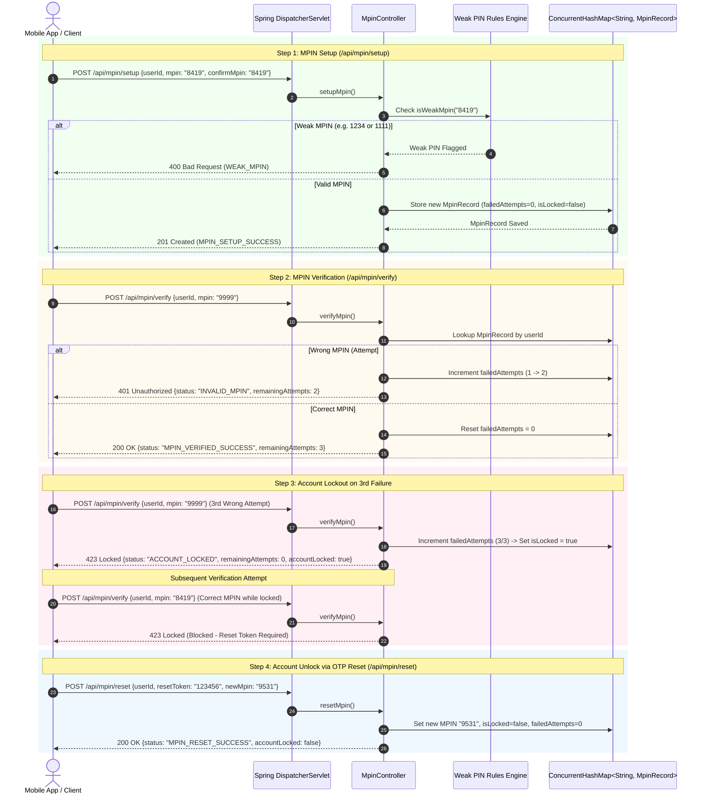
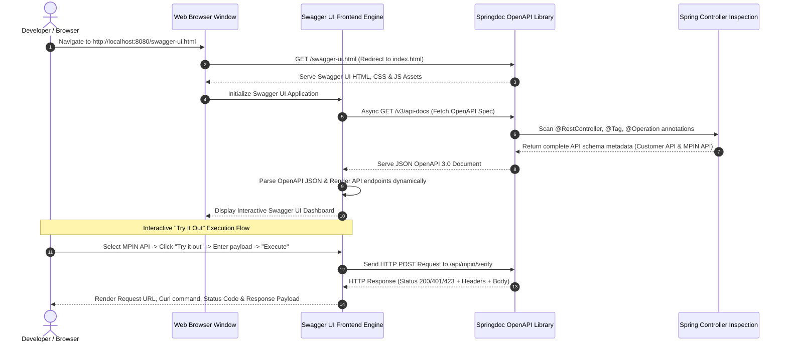
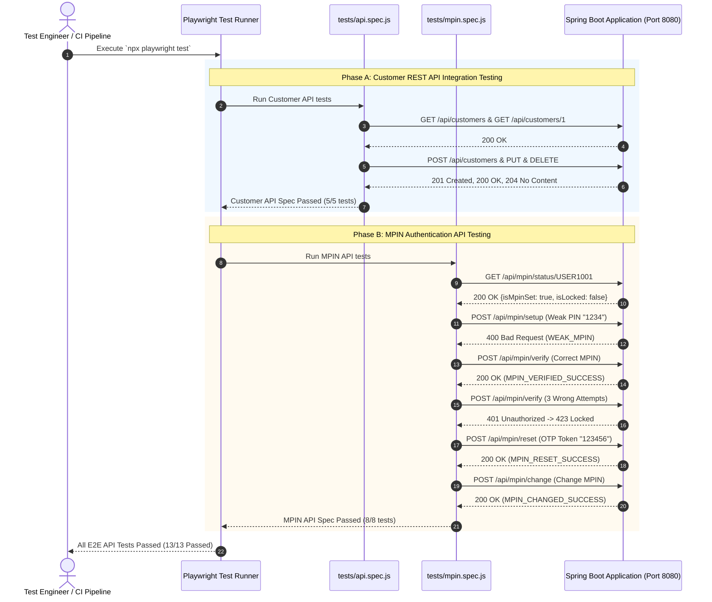

# Customer & MPIN API Sequence Diagrams

This document contains detailed **Mermaid Sequence Diagrams** illustrating the complete lifecycle of request execution, data validation, Swagger UI auto-documentation, MPIN verification flows, and automated testing in the Spring Boot project.

---

## 1. 🔄 Complete REST API CRUD Operations Lifecycle

---

## 2. 🔐 MPIN Setup, Verification & 3-Failure Account Lockout Lifecycle

---

## 3. 📖 OpenAPI Specification & Swagger UI Rendering Flow

---

## 4. 🧪 Playwright Automated E2E Test Execution Flow

